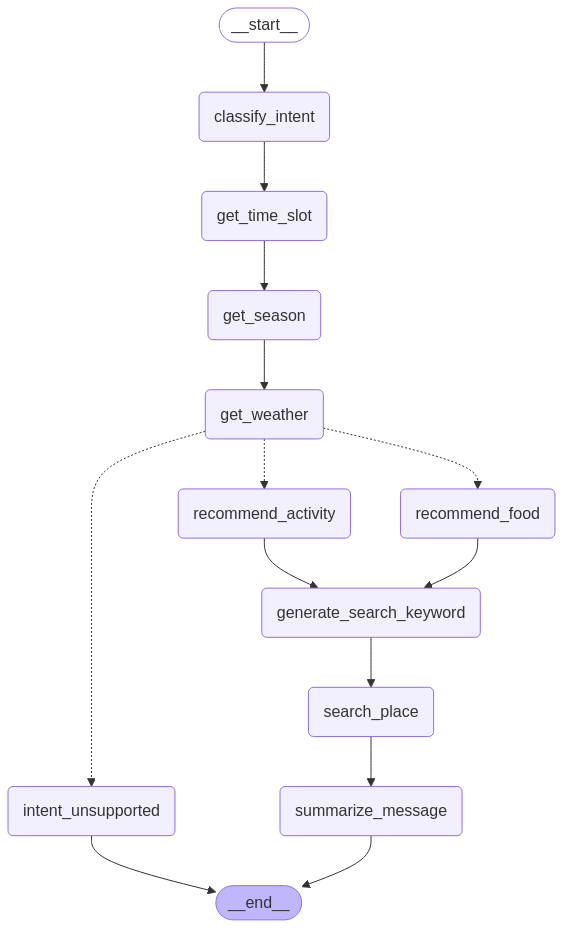

# 🍽️ 오늘은 뭐 먹고 뭐 할까요?

## 📖 프로젝트 개요

**"오늘은 뭐 먹고 뭐 할까요?"**는 LangGraph와 GPT를 활용한 상황별 음식/활동 추천 서비스입니다. 현재 시간, 계절, 날씨, 위치 정보를 실시간으로 분석하여 사용자의 자연어 입력에 맞춰 최적의 추천을 제공합니다.

사용자는 "배고파요", "심심한데 뭐 하지?", "몸이 찌뿌둥해" 같은 일상적인 표현만으로도 적절한 추천을 받을 수 있습니다.

## 🎯 주요 기능

- **자연어 의도 분석**: 사용자 입력을 `food`, `activity`, `unknown` 카테고리로 자동 분류
- **컨텍스트 인식 추천**: 현재 시간대, 계절, 날씨 정보를 반영한 맞춤형 추천
- **위치 기반 서비스**: 사용자의 현재 위치 또는 지정 위치 기반 맞춤 장소 추천
- **자연스러운 응답**: GPT 기반의 친근하고 감성적인 추천 메시지 생성

## 🧩 기술 스택

| 구분 | 사용 기술 |
|------|-----------|
| LLM | OpenAI GPT (configurable via .env) |
| 워크플로우 엔진 | LangGraph |
| 위치 서비스 | Kakao Local API |
| 날씨 정보 | OpenWeather API |
| 프론트엔드 | Streamlit |
| 환경설정 | python-dotenv, .env |

## 🔄 시스템 워크플로우



1. **의도 분류**: 사용자 입력 분석 → 음식/활동 의도 파악
2. **상황 분석**: 시간대/계절/날씨 정보 수집
3. **맞춤 추천**: LLM 기반 음식 또는 활동 추천
4. **위치 검색**: 추천 항목 기반 주변 장소 검색
5. **결과 요약**: 추천 내용과 장소를 자연스러운 메시지로 요약

## 📁 프로젝트 구조

```
📦 food-activity-recommendation
├── 📂 agents/                  # 추천 시스템 구성 에이전트
│   ├── activity.py             # 활동 추천 에이전트
│   ├── food.py                 # 음식 추천 에이전트
│   ├── intent.py               # 의도 분류 에이전트
│   ├── intent_unsupported.py   # 지원하지 않는 의도 처리
│   ├── keyword.py              # 검색 키워드 생성 에이전트
│   ├── llm_factory.py          # LLM 객체 생성 팩토리
│   ├── place.py                # 장소 검색 에이전트
│   ├── season.py               # 계절 판단 에이전트
│   ├── summary.py              # 결과 요약 에이전트
│   ├── time.py                 # 시간대 판단 에이전트
│   └── weather.py              # 날씨 정보 수집 에이전트
├── app.py                      # Streamlit 웹 애플리케이션
├── config.py                   # 환경설정 및 API 키 관리
├── current_location.py         # 위치 감지 모듈
└── run_graph.py                # LangGraph 실행 엔진
```

## 🔧 주요 모듈 설명

| 모듈 | 설명 |
|------|------|
| `intent.py` | 사용자 입력을 분석하여 `food`, `activity`, `unknown` 카테고리로 분류 |
| `time.py` | 현재 시각에 따라 `아침`, `점심`, `저녁`, `새벽` 시간대 판별 |
| `season.py` | 현재 날짜를 기준으로 `봄`, `여름`, `가을`, `겨울` 계절 추출 |
| `weather.py` | OpenWeather API를 사용해 현재 날씨 상태(Clear, Rain 등) 조회 |
| `food.py` | 시간대, 계절, 날씨를 고려한 음식 추천 생성 |
| `activity.py` | 시간대, 계절, 날씨를 고려한 활동 추천 생성 |
| `keyword.py` | 추천된 음식/활동을 장소 검색에 최적화된 키워드로 변환 |
| `place.py` | Kakao Local API를 통해 실제 장소 정보 검색 |
| `summary.py` | 모든 정보를 종합하여 사용자에게 제공할 최종 메시지 생성 |

## 🔧 설치 및 설정

### 1. 요구사항

- Python 3.10 이상
- API 키: OpenAI, OpenWeather, Kakao API

### 2. 설치 방법

```bash
# 저장소 클론
git clone https://github.com/yourusername/food-activity-recommendation.git
cd food-activity-recommendation

# 가상환경 생성 및 활성화
python -m venv venv
source venv/bin/activate  # Windows: venv\Scripts\activate

# 의존성 설치
pip install -r requirements.txt
```

### 3. 환경 설정

`.env` 파일을 생성하고 다음 API 키를 설정합니다:

```
OPENAI_API_KEY=your_openai_api_key
WEATHER_API_KEY=your_openweather_api_key
KAKAO_API_KEY=your_kakao_api_key
OPENAI_MODEL=gpt-4o-mini  # 사용할 모델 지정 (기본값: gpt-4o-mini)
```

## 🚀 실행 방법

Streamlit 앱 실행:

```bash
streamlit run app.py
```

브라우저에서 http://localhost:8501 로 접속하여 서비스를 이용할 수 있습니다.

## 💡 사용 예시

### 음식 추천

```
사용자: "배고픈데 밖에 비가 와서 나가기 싫어"
시스템: [시간/날씨/계절 분석] → 비 오는 날 집에서 즐길 수 있는 음식 추천
```

### 활동 추천

```
사용자: "몸이 찌뿌둥 한데 뭘 하면 좋을까?"
시스템: [시간/날씨/계절 분석] → 현재 상황에 맞는 활동 추천 및 주변 장소 안내
```

## 🧠 시스템 설계 특징

### LangGraph 기반 워크플로우

- **플로우 제어**: 조건부 분기와 순차적 처리를 통한 복잡한 추천 로직 구현
- **상태 관리**: 대화 컨텍스트와 추천 정보를 상태로 관리
- **모듈화**: 각 기능별 에이전트 분리로 유지보수성 향상

### 위치 서비스 기능

- **IP 기반 위치 감지**: 현재 IP 주소 기반 대략적 위치 파악
- **좌표 ↔ 주소 변환**: 좌표를 주소로, 주소를 좌표로 변환하는 양방향 지오코딩
- **장소 검색**: 현재 위치 기준 반경 내 장소 검색
